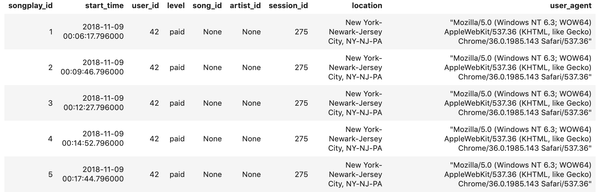

# Project Description

The aim of this project is to provide an automated ETL pipeline for a startup called Sparkify.
This project extracts data related to user activity and information about different songs and artists from raw json files.
Then it executes a set of sql queries to populate a relational database.

The relational database model follows the star schema, which eases how data in inserted and queried for bussiness porpuses.
The database is composed by one fact table and 4 dimension tables being:

## Fact Table
1. songplays - records in log data associated with song plays 
## Dimension Tables
1. users - users in the app
2. songs - songs in music database
3. artists - artists in music database
4. time - timestamps of records in songplays broken down into specific units

# Some queries that can be executed.

To retrieve data from the songplays table in the database you can try the following query:
sql SELECT * FROM songplays LIMIT 5;

# Project Content

The project contains the following files:
data: Contains raw information in json format about songs and user logs.
etl.ipynb : Jupyter notebook used to execute some of the elements in the ETL pipeline for demonstration porpuses.
test.ipynb : Jupyter notebook used to test your database. For example, it executes queries that must retrieve some information if the tables were populated properly.
create_tables.py : Connects to a default database and creates the tables described in the Project Description section above. This script deletes the tables in case that they already exists.
etl.py : Executes the whole ETL pipiline, thus, populating the database with the json files inside the data folder

# Project execution
To execute this project run the following commands:

1. python create_tables.py
This command creates both the database and the tables to be used.
2. python etl.py
This command extracts and transform the information contained within the folder data and populates the database.

# Metadata

1. This project was developed by Cristhian Murcia, cristhianmurcia182@gmail.com.
2. The data used was kindly provided by Udacity in the scope of their Data Engineering Nanodegre program.